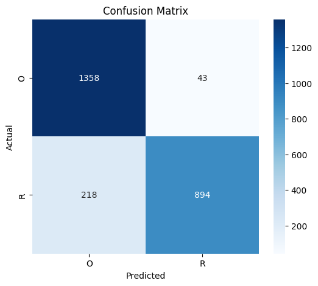
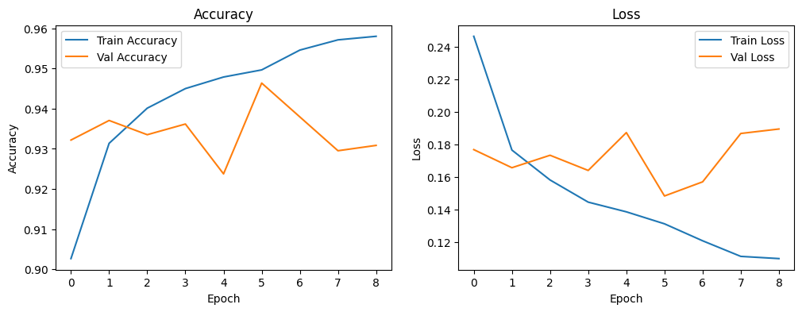
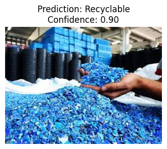

# Klasifikasi Sampah Menggunakan CNN & MobileNet

Proyek ini adalah implementasi *Deep Learning* untuk mengklasifikasikan jenis sampah (Waste Classification) menggunakan metode **Transfer Learning** dengan arsitektur **MobileNet** sebagai *base model*.  Sistem ini dapat mengidentifikasi apakah sampah termasuk kategori **Organik (O)** atau **Daur Ulang (R)** dengan akurasi **89. 6%**.

## 📋 Daftar Isi
- [Deskripsi Proyek](#deskripsi-proyek)
- [Fitur Utama](#fitur-utama)
- [Struktur Folder](#struktur-folder)
- [Prasyarat & Instalasi](#prasyarat--instalasi)
- [Dataset](#dataset)
- [Cara Penggunaan](#cara-penggunaan)
- [Hasil & Evaluasi](#hasil--evaluasi)
- [Teknologi yang Digunakan](#teknologi-yang-digunakan)
- [Kontribusi](#kontribusi)
- [Lisensi](#lisensi)

## 📖 Deskripsi Proyek
Sistem ini dirancang untuk mendeteksi dan mengkategorikan sampah secara otomatis dari gambar menggunakan teknik *Computer Vision*. Model dilatih menggunakan *Convolutional Neural Network* (CNN) dengan memanfaatkan *pre-trained model* **MobileNet** untuk klasifikasi biner:   **Organik (O)** dan **Daur Ulang (R)**. 

Proyek ini terdiri dari:
- **Jupyter Notebook** untuk eksperimen, pelatihan, dan evaluasi model
- **Aplikasi Streamlit** (`app.py`) untuk inferensi dan demo interaktif
- **Model tersimpan** dalam format `.keras` yang siap digunakan

### File notebook mencakup langkah-langkah: 
1. Data Preprocessing & Augmentasi
2. Pembangunan Model (Transfer Learning MobileNet)
3. Pelatihan (Training) & Validasi
4. Evaluasi Model (Accuracy, Confusion Matrix, Classification Report)
5. Penyimpanan Model (`.keras`)

## ✨ Fitur Utama
- ✅ Klasifikasi sampah menjadi 2 kategori: **Organik (O)** dan **Daur Ulang (R)**
- ✅ Transfer Learning dengan **MobileNet** untuk efisiensi dan akurasi tinggi
- ✅ Aplikasi web interaktif menggunakan **Streamlit**
- ✅ Model pre-trained siap pakai (`waste_classifier_mobilenet. keras`)
- ✅ Data augmentasi untuk meningkatkan generalisasi model
- ✅ Notebook lengkap untuk reproduksi eksperimen
- ✅ Test Accuracy **89.61%** dengan F1-Score **0.89**

## 📂 Struktur Folder
Berikut adalah susunan direktori proyek:  

```text
klasifikasi-jenis-sampah/
├── app.py                                   # Aplikasi Streamlit untuk inferensi model
├── KLASIFIKASI_SAMPAH_CNN_MOBILE_NET.ipynb  # Notebook untuk training dan eksperimen
├── requirements.txt                         # Dependencies Python
├── waste_classifier_mobilenet.keras         # Model MobileNet terlatih (11.6 MB)
├── images/                                  # Folder untuk hasil visualisasi evaluasi
│   ├── evaluate_matplot.png                 # Grafik training/validation curves
│   ├── confusion_matrix.png                 # Confusion matrix visualisasi
│   └── example_result.png                   # Contoh hasil prediksi
└── README.md                                # Dokumentasi proyek
```

## 🔧 Prasyarat & Instalasi

### Prasyarat
- Python 3.8 atau lebih tinggi
- pip (Python package manager)
- Jupyter Notebook atau Google Colab (untuk menjalankan `.ipynb`)

### Instalasi Dependencies
Clone repositori ini dan install dependencies:

```bash
git clone https://github.com/MashuNakamura/klasifikasi-jenis-sampah.git
cd klasifikasi-jenis-sampah
pip install -r requirements.txt
```

**Catatan:** `requirements.txt` berisi:  
```
streamlit
tensorflow
```

Untuk development atau menjalankan notebook, Anda mungkin perlu:
```bash
pip install jupyter numpy pandas matplotlib scikit-learn pillow seaborn
```

## 📊 Dataset
Model dilatih menggunakan dataset gambar sampah dengan struktur folder seperti berikut: 

```
dataset/
├── train/
│   ├── O/          # Sampah Organik
│   └── R/          # Sampah Daur Ulang
├── validation/
│   ├── O/
│   └── R/
└── test/
    ├── O/          # 1,401 gambar
    └── R/          # 1,112 gambar
```

**Total Data Testing:** 2,513 gambar
- **Organik (O):** 1,401 gambar
- **Daur Ulang (R):** 1,112 gambar

Dataset dapat diunduh dari sumber publik seperti: 
- [Kaggle - Waste Classification Dataset](https://www.kaggle.com/)
- Dataset custom yang telah dikurasi

**Catatan:** Dataset tidak disertakan dalam repositori ini karena ukurannya yang besar.  

## 🚀 Cara Penggunaan

### 1. Menjalankan Aplikasi Streamlit
Untuk melakukan prediksi menggunakan aplikasi web interaktif:

```bash
streamlit run app.py
```

Aplikasi akan terbuka di browser pada `http://localhost:8501`. Upload gambar sampah dan model akan memprediksi kategorinya.

### 2. Menjalankan Notebook untuk Training
Buka notebook di Jupyter atau Google Colab:

```bash
jupyter notebook KLASIFIKASI_SAMPAH_CNN_MOBILE_NET.ipynb
```

Atau upload ke [Google Colab](https://colab.research.google.com/) untuk menggunakan GPU gratis.

### 3. Inferensi Manual dengan Python
```python
import tensorflow as tf
from tensorflow. keras. preprocessing import image
import numpy as np

# Load model
model = tf.keras.models.load_model('waste_classifier_mobilenet.keras')

# Preprocess gambar
img_path = 'path/to/your/image.jpg'
img = image.load_img(img_path, target_size=(224, 224))
img_array = image.img_to_array(img)
img_array = np.expand_dims(img_array, axis=0)
img_array = img_array / 255.0

# Prediksi
predictions = model.predict(img_array)
class_names = ['Organik (O)', 'Daur Ulang (R)']
predicted_class = class_names[int(predictions[0] > 0.5)]

print(f"Prediksi: {predicted_class}")
print(f"Confidence: {predictions[0][0]:.2%}")
```

## 📈 Hasil & Evaluasi

### Performa Model

#### Metrik Validasi
| Metrik              | Nilai    |
|---------------------|----------|
| **Validation Accuracy**  | **94.97%** |
| **Validation Loss**      | **0.1414** |

#### Metrik Testing
| Metrik         | Nilai    |
|----------------|----------|
| **Test Accuracy**   | **89.61%** |
| **Test Loss**       | **0.2857** |

### Classification Report

```
              precision    recall  f1-score   support

           O       0.86      0.97      0.91      1401
           R       0.95      0.80      0.87      1112

    accuracy                           0.90      2513
   macro avg       0.91      0.89      0.89      2513
weighted avg       0.90      0.90      0.89      2513
```

### Analisis Performa per Kelas

| Kelas | Precision | Recall | F1-Score | Support |
|-------|-----------|--------|----------|---------|
| **Organik (O)** | 86% | 97% | 91% | 1,401 |
| **Daur Ulang (R)** | 95% | 80% | 87% | 1,112 |

**Insight:**
- Model memiliki **recall tinggi (97%)** untuk kelas Organik, artinya sangat baik dalam mendeteksi sampah organik
- Model memiliki **precision tinggi (95%)** untuk kelas Daur Ulang, artinya prediksi daur ulang sangat akurat
- Weighted average accuracy **90%** menunjukkan performa yang konsisten di kedua kelas

### Confusion Matrix



**Analisis Confusion Matrix:**
- **True Positive (O→O):** 1,358 sampah organik diprediksi benar
- **False Negative (O→R):** 43 sampah organik salah diprediksi sebagai daur ulang (3. 1%)
- **False Positive (R→O):** 218 sampah daur ulang salah diprediksi sebagai organik (19.6%)
- **True Positive (R→R):** 894 sampah daur ulang diprediksi benar

### Visualisasi Training



Grafik menunjukkan: 
- Konvergensi yang baik antara training dan validation
- Tidak ada indikasi overfitting yang signifikan
- Loss menurun stabil selama proses training

### Contoh Hasil Prediksi



Visualisasi menampilkan contoh prediksi model dengan confidence score untuk berbagai jenis sampah.

## 🛠️ Teknologi yang Digunakan
- **Python** - Bahasa pemrograman utama
- **TensorFlow/Keras** - Framework deep learning
- **MobileNet** - Pre-trained model untuk transfer learning
- **Streamlit** - Framework aplikasi web
- **Jupyter Notebook** - Environment untuk eksperimen
- **NumPy & Pandas** - Data manipulation
- **Matplotlib & Seaborn** - Visualisasi

## 🎯 Cara Kerja Model

### Arsitektur MobileNet
MobileNet adalah arsitektur CNN yang dioptimalkan untuk perangkat mobile dengan: 
- **Depthwise Separable Convolutions** untuk efisiensi komputasi
- **Transfer Learning** dari ImageNet pre-trained weights
- **Fine-tuning** layer terakhir untuk klasifikasi sampah

### Pipeline Prediksi
1. **Input:** Gambar sampah (format JPG/PNG)
2. **Preprocessing:** Resize ke 224x224, normalisasi ke [0,1]
3. **Feature Extraction:** MobileNet layers (frozen/partially frozen)
4. **Classification:** Dense layers + Sigmoid activation
5. **Output:** Probabilitas kelas O (Organik) atau R (Daur Ulang)