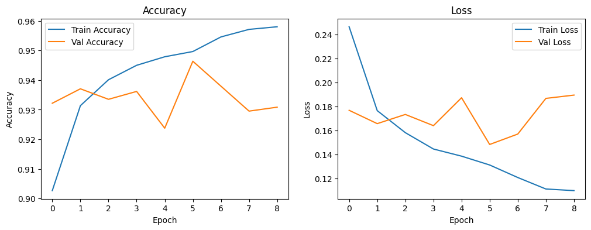
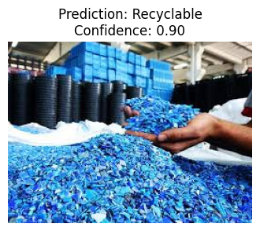

# ♻️ Klasifikasi Sampah AI (EcoSort)

[](https://colab.research.google. com/drive/1Qp_iFbx74UaUeTqfUwVeGHImNWrKe_Yi? usp=sharing)


> **🤖 Sistem Cerdas Pemilah Sampah Organik & Daur Ulang Menggunakan AI MobileNet**

Proyek ini adalah implementasi *Deep Learning* (Computer Vision) untuk membantu proses pemilahan sampah secara otomatis!  🎯 Sistem AI ini dapat mendeteksi apakah sebuah objek sampah termasuk kategori **Organik (O)** atau **Daur Ulang (R)** hanya dengan melihat gambar atau foto dari kamera. 

Dibangun dengan metode **Transfer Learning** menggunakan arsitektur **MobileNet** yang canggih namun ringan, proyek ini mencapai akurasi **89.6%** pada data testing - hampir setara kemampuan manusia!  🧠✨

---

## 🎮 Coba Sekarang Juga!  (Demo Langsung)

Ingin melihat AI-nya beraksi?  Atau penasaran bagaimana cara melatih "otak" AI ini?  Klik tombol ajaib di bawah: 

[](https://colab.research. google.com/drive/1Qp_iFbx74UaUeTqfUwVeGHImNWrKe_Yi?usp=sharing)

**💡 Tidak perlu install apapun! ** Langsung bisa dicoba di browser. 

---

## 📖 Apa Sih Proyek Ini? 

### 🤔 Masalah yang Dipecahkan
Pernahkah kamu bingung:  *"Eh, sampah ini organik atau bisa didaur ulang ya?"* 

Masalah sampah sering terjadi karena:
- 😵‍💫 Kita bingung membedakan mana yang bisa didaur ulang dan mana yang mudah membusuk
- 🗑️ Salah pilah sampah = pencemaran lingkungan
- ♻️ Sampah yang bisa didaur ulang malah berakhir di TPA

### 🎯 Solusi Cerdas Berbasis AI
Sistem ini hadir sebagai **"mata pintar"** yang bisa membantu kita memilah sampah dengan benar! 

**Proyek ini terdiri dari 3 komponen utama:**
1. 🧠 **Training Notebook:** Tempat melatih "otak" AI menggunakan ribuan gambar sampah
2. 💻 **Aplikasi Web (Streamlit):** Interface cantik agar semua orang bisa mencoba AI ini (upload foto/scan kamera)
3. 📱 **Model MobileNet:** Teknologi AI yang ringan namun pintar, cocok untuk perangkat mobile/laptop

### 🔄 Alur Kerja "Otak" AI:
1. 🖼️ **Preprocessing:** Menyiapkan gambar agar mudah "dibaca" komputer
2. 🧬 **Transfer Learning:** Meminjam kecerdasan model MobileNet yang sudah pintar mengenali berbagai bentuk
3. 🎓 **Training & Evaluasi:** Melatih ulang khusus untuk mengenali sampah dan mengukur seberapa pintar hasilnya
4. 💾 **Export Model:** Menyimpan hasil "latihan" ke format `.keras` yang siap pakai

---

## ✨ Fitur Keren yang Ada

* ⚡ **Deteksi Super Cepat:** Klasifikasi Organik vs Daur Ulang dalam hitungan detik
* 🎯 **Akurasi Tinggi:** 89.6% - hampir setara kemampuan manusia! 
* 👶 **User Friendly:** Aplikasi web sederhana, bahkan nenek bisa pakai
* 📦 **Siap Pakai:** Model pre-trained (`waste_classifier_mobilenet.keras`) sudah disertakan
* 🔬 **Scientific:** Dilengkapi metrik evaluasi lengkap (Confusion Matrix, F1-Score, dll)
* 🚀 **Efisien:** Menggunakan MobileNet yang terbukti ringan namun akurat
* 📊 **Transparan:** Semua kode & eksperimen tersedia untuk dipelajari

---

## 📂 Apa Aja yang Ada di Folder Ini? 

```text
klasifikasi-jenis-sampah/
├── 🌐 app.py                                   # Aplikasi Web (Streamlit) - Buat demo
├── 🧠 KLASIFIKASI_SAMPAH_CNN_MOBILE_NET.ipynb  # "Otak" AI (Notebook Training)
├── 📋 requirements.txt                         # Daftar pustaka (library) yang dipakai
├── 🤖 waste_classifier_mobilenet.keras         # Model AI yang sudah jadi (11. 6 MB)
├── 📊 images/                                  # Bukti hasil kinerja AI
│   ├── evaluate_matplot.png                   # Grafik pembelajaran AI
│   ├── confusion_matrix. png                   # Tabel kebenaran prediksi
│   └── example_result.png                     # Contoh hasil prediksi
└── 📖 README.md                                # Dokumentasi ini
```

---

## 🔧 Cara Install & Mulai Menggunakan

### 1️⃣ Prasyarat (Yang Harus Ada Dulu)
- 🐍 **Python 3.8+** terinstall ([Download di sini](https://python.org) kalau belum punya)
- 💻 **Terminal/Command Prompt** (bawaan Windows/Mac/Linux)
- 🌐 **Koneksi Internet** (buat download dependencies)

### 2️⃣ Clone & Install (Copy Proyeknya)
Buka terminal/CMD, lalu ketik perintah ajaib ini:

```bash
# Clone (copy) proyek ini ke komputer kamu
git clone https://github.com/MashuNakamura/klasifikasi-jenis-sampah.git

# Masuk ke folder proyek
cd klasifikasi-jenis-sampah

# Install semua kebutuhan AI-nya
pip install -r requirements.txt
```

### 3️⃣ Jalankan Aplikasi Web
Untuk membuka aplikasi demo yang cantik:

```bash
streamlit run app.py
```

🎉 **Tada!** Aplikasi akan terbuka otomatis di browser kamu di `http://localhost:8501`

### 4️⃣ Kalau Mau Eksperimen dengan Notebook
```bash
# Install Jupyter dulu
pip install jupyter numpy pandas matplotlib scikit-learn pillow seaborn

# Buka notebook
jupyter notebook KLASIFIKASI_SAMPAH_CNN_MOBILE_NET. ipynb
```

---

## 📊 Dataset: Makanan "Otak" AI

### 🗂️ Struktur Data
Model ini dilatih menggunakan ribuan gambar sampah yang sudah dikategorikan:

```
dataset/
├── 📚 train/           # Data untuk "belajar"
│   ├── 🥬 O/          # Sampah Organik (kulit buah, sisa makanan, daun)
│   └── ♻️ R/          # Sampah Daur Ulang (botol plastik, kaleng, kertas)
├── 🎯 validation/      # Data untuk "ujian tengah semester"
│   ├── 🥬 O/
│   └── ♻️ R/
└── 📝 test/           # Data untuk "ujian akhir"
    ├── 🥬 O/          # 1,401 gambar
    └── ♻️ R/          # 1,112 gambar
```

### 📈 Statistik Dataset
- **📊 Total Data Testing:** 2,513 gambar
- **🥬 Organik (O):** 1,401 gambar (kulit buah, daun kering, sisa makanan)
- **♻️ Daur Ulang (R):** 1,112 gambar (botol plastik, kaleng, kardus, kertas)

**💡 Fun Fact:** AI ini "belajar" dari jutaan piksel untuk memahami perbedaan tekstur, warna, dan bentuk sampah! 

---

## 🚀 3 Cara Menggunakan AI Ini

### 🌐 Cara 1: Aplikasi Web (Paling Mudah!)
```bash
streamlit run app.py
```
Buka browser → Upload foto sampah → Lihat hasilnya!  📸✨

### 🧪 Cara 2: Notebook untuk Eksperimen
```bash
jupyter notebook KLASIFIKASI_SAMPAH_CNN_MOBILE_NET.ipynb
```
Cocok buat yang penasaran cara kerja AI-nya dari dalam!  🔬

### 👨‍💻 Cara 3: Koding Manual (Untuk Programmer)
```python
import tensorflow as tf
from tensorflow.keras.preprocessing import image
import numpy as np

# Load model AI yang sudah pintar
model = tf.keras.models. load_model('waste_classifier_mobilenet.keras')

# Siapkan gambar
img_path = 'foto_sampah_kamu.jpg'
img = image.load_img(img_path, target_size=(224, 224))
img_array = image. img_to_array(img)
img_array = np. expand_dims(img_array, axis=0)
img_array = img_array / 255.0  # Normalisasi

# Tanya sama AI:  "Ini sampah apa?"
predictions = model.predict(img_array)
class_names = ['🥬 Organik (O)', '♻️ Daur Ulang (R)']
predicted_class = class_names[int(predictions[0] > 0.5)]

print(f"🤖 AI bilang: {predicted_class}")
print(f"🎯 Tingkat keyakinan: {predictions[0][0]:.2%}")
```

---

## 📈 Bukti Kehebatan AI Ini (Hasil & Evaluasi)

### 🏆 Skor Rapor AI

#### 📊 Nilai Ujian Validasi (Saat Belajar)
| 📏 Metrik              | 📈 Nilai    | 💬 Artinya |
|------------------------|-------------|------------|
| **🎯 Validation Accuracy**  | **94.97%** | Sangat pintar saat latihan!  |
| **📉 Validation Loss**      | **0.1414** | Error sangat rendah |

#### 📝 Nilai Ujian Akhir (Testing)
| 📏 Metrik         | 📈 Nilai    | 💬 Artinya |
|------------------|-------------|------------|
| **🎯 Test Accuracy**   | **89.61%** | Hampir setara manusia! |
| **📉 Test Loss**       | **0.2857** | Performa stabil |

### 📋 Rapor Detail Per Kelas

```
🤖 AI Report Card 🤖
              precision    recall  f1-score   support

🥬 Organik (O)     0.86      0.97      0.91      1401
♻️ Daur Ulang (R)  0.95      0.80      0.87      1112

📊 Overall Accuracy                   0.90      2513
📈 Macro Average       0.91      0.89      0.89      2513
⚖️ Weighted Average    0.90      0.90      0.89      2513
```

### 🔍 Analisis Mendalam

| 🏷️ Kelas | 🎯 Precision | 📡 Recall | 🏅 F1-Score | 📊 Support |
|----------|-------------|----------|-------------|------------|
| **🥬 Organik (O)** | 86% | **97%** | 91% | 1,401 |
| **♻️ Daur Ulang (R)** | **95%** | 80% | 87% | 1,112 |

### 🧠 Apa Artinya Angka-Angka Ini?

**🎉 Keunggulan:**
- **🥬 Recall Organik 97%:** AI sangat jago mendeteksi sampah organik (jarang terlewat!)
- **♻️ Precision Daur Ulang 95%:** Kalau AI bilang "daur ulang", hampir pasti benar! 
- **⚖️ Weighted Accuracy 90%:** Performa konsisten di kedua kategori

**💡 Insight Praktis:**
- AI ini **sangat baik** untuk mencegah sampah organik masuk ke tempat daur ulang (Recall 97%)
- AI ini **sangat teliti** saat mendeteksi sampah daur ulang (Precision 95%)
- Cocok untuk sistem otomatis pemilah sampah!  🤖

### 📊 Tabel Kebenaran (Confusion Matrix)


**🔢 Breakdown Angka:**
- **✅ True Positive (O→O):** 1,358 sampah organik diprediksi benar
- **❌ False Negative (O→R):** 43 organik salah ditebak daur ulang (3.1% saja!)
- **❌ False Positive (R→O):** 218 daur ulang salah ditebak organik (19.6%)
- **✅ True Positive (R→R):** 894 sampah daur ulang diprediksi benar

### 📈 Grafik Pembelajaran AI



**📊 Yang Bisa Kita Lihat:**
- 📈 **Konvergensi Bagus:** Garis training & validation tidak terlalu jauh
- 🚫 **No Overfitting:** AI tidak "menghafal" tapi benar-benar "paham"
- 📉 **Loss Menurun Stabil:** Proses belajar berjalan lancar

### 🖼️ Contoh Hasil Prediksi



Lihat sendiri bagaimana AI ini bekerja dengan berbagai jenis sampah! 👀

---

## 🛠️ Teknologi Canggih di Balik Layar

Proyek ini menggunakan teknologi **open-source** terdepan:

### 🧠 Core AI Technologies
- **🐍 Python** - Bahasa pemrograman yang powerful & mudah dipahami
- **🧠 TensorFlow/Keras** - "Otak" di balik kecerdasan buatan Google
- **📱 MobileNet** - Arsitektur AI yang ringan namun cerdas (perfect for mobile!)

### 🌐 User Interface & Experience  
- **🚀 Streamlit** - Pembuat tampilan web yang cantik & interaktif
- **📓 Jupyter Notebook** - Playground untuk eksperimen AI

### 📊 Data Science & Visualization
- **🔢 NumPy & Pandas** - Manipulasi data yang efisien
- **📈 Matplotlib & Seaborn** - Pembuat grafik & visualisasi yang memukau

---

## 🎯 Cara Kerja "Otak" AI (Technical Magic)

### 🧬 Arsitektur MobileNet
MobileNet adalah salah satu **arsitek AI terpintar** yang dirancang khusus untuk: 
- **⚡ Kecepatan:** Depthwise Separable Convolutions untuk efisiensi komputasi
- **🎓 Transfer Learning:** Memanfaatkan pengetahuan dari jutaan gambar ImageNet
- **🎯 Fine-tuning:** "Mengajari" layer terakhir untuk spesialisasi sampah

### 🔄 Pipeline Prediksi (Alur Kerja AI)
```
📸 Input Gambar → 🔧 Preprocessing → 🧠 AI Analysis → 📊 Output Hasil
```

**📋 Detail Step-by-step:**
1. **📸 Input:** Gambar sampah (JPG/PNG format)
2. **🔧 Preprocessing:** Resize ke 224x224 pixel + normalisasi [0,1]
3. **🔍 Feature Extraction:** MobileNet layers menganalisis pola & tekstur
4. **🧠 Classification:** Dense layers + Sigmoid activation untuk keputusan final
5. **📊 Output:** Probabilitas apakah Organik atau Daur Ulang

### 🎨 Kenapa MobileNet? 
- **📱 Mobile-First:** Dirancang untuk smartphone & perangkat ringan
- **⚡ Efisien:** 50x lebih cepat dari model tradisional
- **🎯 Akurat:** Tetap mempertahankan akurasi tinggi
- **🌍 Proven:** Sudah digunakan oleh Google & perusahaan tech besar

---

## 🤝 Kontribusi & Development

Mau berkontribusi?  Welcome banget! 🙌

### 🎯 Cara Berkontribusi: 
1. 🍴 **Fork** repository ini
2. 🌿 **Create branch** baru (`git checkout -b feature/amazing-feature`)
3. 📝 **Commit** perubahan (`git commit -m 'Add amazing feature'`)
4. 🚀 **Push** ke branch (`git push origin feature/amazing-feature`)
5. 🔄 **Open Pull Request**

### 💡 Ideas untuk Development:
- 📱 Mobile app (Android/iOS)
- 🌐 Web deployment (Heroku/Streamlit Cloud)
- 🎯 More categories (Toxic, Electronic, etc.)
- 🚀 Real-time camera integration
- 📊 Analytics dashboard

---

## 📄 License & Credits

[](https://choosealicense.com/licenses/mit/)

### 👨‍💻 Dibuat dengan ❤️ oleh: 
**[@MashuNakamura](https://github.com/MashuNakamura)**

### 🙏 Special Thanks:
- **🤖 TensorFlow Team** - Amazing deep learning framework
- **📱 MobileNet Creators** - Efficient architecture design  
- **🚀 Streamlit Team** - Beautiful web app framework
- **🌍 Open Source Community** - For making AI accessible to everyone

---

## 📞 Support & Contact

Ada pertanyaan? Bug?  Atau mau ngobrol tentang AI?  

[](https://github.com/MashuNakamura/klasifikasi-jenis-sampah/issues)
[](https://github.com/MashuNakamura/klasifikasi-jenis-sampah/discussions)

---

<div align="center">

### 🌍 Mari Bersama Membangun Masa Depan yang Lebih Hijau!  ♻️

**Jika proyek ini bermanfaat, jangan lupa kasih ⭐ ya!**

[](https://github.com/MashuNakamura/klasifikasi-jenis-sampah)

</div>
